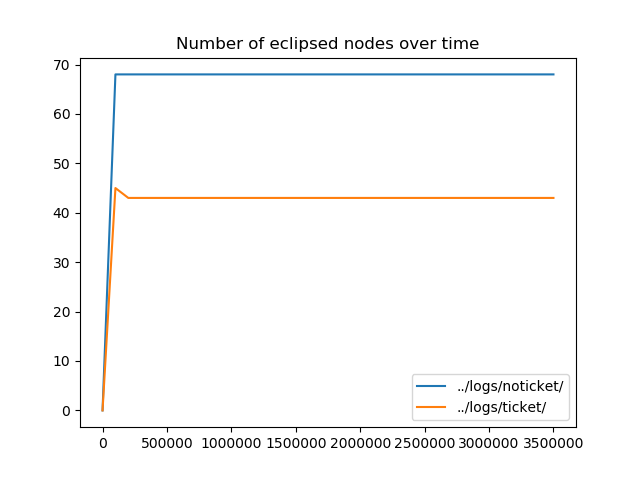
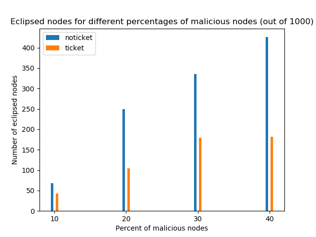

# Report with attacks

## Setup
The report consist of a comparison between simulations using the following configuration files:
* `./config/discv5ticketattack.cfg` 
* `./config/discv5noticketattack.cfg` 

The parameters used in the simulation are the following:
* 1000 nodes
* No turbulence/churn.
* Bucket size: 17 (for routing, ticket and search table).
* Topic table: 100 per topic limit and 500 total limit.
* Ticket expiration time: 15min.
* By default, 10% of the nodes are malicious.  
* Nodes are assigned to a single topic based on a Zipf distribution (exponent 0.7). 
* By default, malicious nodes are assigned IDs that are close to the topic ID they attack.

The default behavior of attackers are as follows:
* Spam other nodes for their assigned topic. 
* Return other malicious nodes in result of topic queries.

  
   

Fig.1. In the above graphs, we see the number of registrations by good and malicious nodes when the IDs of the malicious nodes are chosen in a non-uniform manner. On the left is the noticket protocol, and on the right is the ticket protocol. In both protocols the ratio of good to malicious registrations is roughly the same which is important for a fair comparison.

  
   

Fig.2. In the above graphs, we see the number of registrations by good and malicious nodes when the IDs of the malicious nodes are chosen in a uniform manner (similar to good nodes). On the left is the noticket protocol, and on the right is the ticket protocol. 

From Figures 1 and 2, we see that good (non-malicious) nodes are more successful in registering their ads on other good nodes when the ID distribution of malicious nodes in uniform. This is more apparent in the noticket protocol. This is expected because in the ticket protocol, the registrations are made uniformly throughout the hash space whereas in the noticket protocol many of the registrations are made at nodes close to the topic hash (especially when there is contention for topic storage resources).

  
   

Fig.3. In the above graph, we see the number of malicious entries in the results to topic queries when the IDs of the malicious nodes are chosen in a non-uniform manner. On the left is the noticket protocol, and on the right is the ticket protocol. We observe that the percent of malicious ads (registrations of malicious nodes) returned in the topic queries is higher for the noticket protocol. This is also expected since the results are mostly obtained from nodes close to the topic hash in this protocol when malicious nodes are located close to the topic ID in the hash space.

  
   

Fig.4. In the above graph, we see the number of malicious entries in the results to topic queries when the IDs of the malicious nodes are chosen in a non-uniform manner. On the left is the noticket protocol, and on the right is the ticket protocol. When malicious node IDs are generated uniformly, both protocols obtain similar percentage of malicious ads in their topic query results.

Fig. 5. In the above plot, we see the number of eclipsed nodes over time for both ticket (blue) and noticket (orange). Because each node forms their outgoing connection decisions early on, the number of eclipsed nodes do not change over time. Here, we see that the number of eclipsed nodes in the ticket protocol is lower than the noticket protocol. When the ID distribution is random, the number of eclipsed nodes is 0 for both protocols (with 10% of nodes being malicious).

  
   

Fig.6. In the above plots, we see the distribution of registrars for both protocols in the presence of 10% malicious nodes. On the left is the noticket protocol, and on the right is the ticket protocol. 

  
   

Fig.7. In the above plots, we see the distribution of registrants for both protocols in the presence of 10% malicious nodes. On the left is the noticket protocol, and on the right is the ticket protocol. 

  
   

Fig.8. In the above plots, we see the distribution of nodes types (aclipsed/non-eclipsed/malicious) for both protocols in the presence of 20% malicious nodes. On the left is the noticket protocol, and on the right is the ticket protocol. 

Fig.9. In the above plot, we see the number of eclipsed nodes for difference percentages of malicious nodes (10%-40%) for a total of 1000 nodes.
